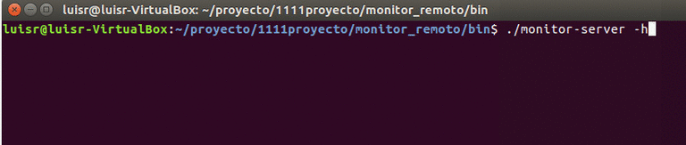
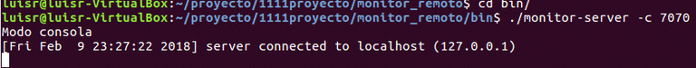
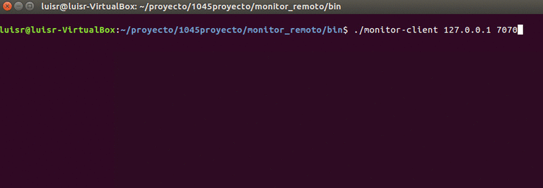

# README #

Repositorio del proyecto final de la materia de Programacion de Sistemas - ESPOL II Termino 2017

### Descripcion del Proyecto ###

El proyecto consiste en la creacion de una aplicacion cliente-servidor para monitorear remotamente el estado de una computadora.

### Compilacion ###

* Compilar el cliente:
	* make client

* Compilar el servidor:
	* make server

* Compilar todo:
	*make

### Carpetas del Proyecto ###

Luego de hacer make, se tendran las siguientes carpetas: 

```
	* bin
	* include
	* lib
	* obj
	* src
	* media
	- Makefile
	- Readme.md

```
En *bin* se encontraran los ejecutables *monitor-server* y *monitor-client*.

En *include* estan los archivos de cabecera que usaremos en el proyecto. \n

En *lib* esta la libreria dinamica *libcbor* que usaremos para realizar la serializacion de los datos que seran enviados del servidor al cliente.\n

En *obj* estara el archivo .o de csapp.c, que usamos en este proyecto. 

En *src* estara el codigo de los componentes principales del proyecto, *client.c*, *server.c*

En *media* estan imagenes gif con capturas de pantalla de la ejecucion del proyecto.

### Uso ###

** Uso del servidor **

El servidor, por defecto, se ejecutara como *daemon* en el *background*. 
El servidor es capaz de soportar varios clientes. Veamos que *flags* maneja nuestro servidor:

* #### Opcion -h:

Se muestra un mensaje de ayuda:

```
./monitor-server -h
Opciones:
	-h: ayuda (este mensaje)
	-c: modo consola
	-l: archivo de log
```

#### Captura ####




*Si a más de -h se coloca otra opcion, solo se ejecuta -h*

* #### Opcion -c:

Usando el flag *-c*, el programa no se ejecutara en el *background* ni se escribira en el archivo de log predefinido que se encuentra en el *root* del proyecto, sino que los eventos de conexion que ocurran mientras el servidor este activo, se presentaran en pantalla con el siguiente formato:

```
./monitor-server -c 8080
Modo consola
[Fri Feb  9 22:00:54 2018] server connected to localhost (127.0.0.1)
[Fri Feb  9 22:01:15 2018] server connected to localhost (127.0.0.1)
```
#### Captura ####




*En modo consola no se escribira en ningun archivo de log*

* #### Opcion -l <*path*> :

Con esta opcion se cambia el archivo de log por defecto (carpeta del proyecto), a una que desee el usuario.

Ejemplo de conexion:

```
./monitor-server -l /var/log/monitor_log.txt 8080
```

Con esto se cambiaria el archivo de log por defecto, a: */var/log/monitor_log.txt* .

*Si se ejecuta el programa con el flag -c y -l, no se escribira en el archivo de log especificado en -l, sino solo en la consola.*

** Uso del cliente **

El cliente se ejecutara especificando la *ip* y el *puerto* del servidor que se encuentra activo. Obteniendo la siguiente salida: 



### Referencias ###

Si desea mas informacion sobre la libreria de cbor usada, aqui podra encontrar informacion sobre [cbor](http://libcbor.org/), ademas de una [guia rapida de instalacion](http://libcbor.readthedocs.io/en/v0.4.0/index.html) local.

### Integrantes ###
 * Geancarlo Murillo
 * Luis Rodriguez

> ESPOL II TERMINO 2017